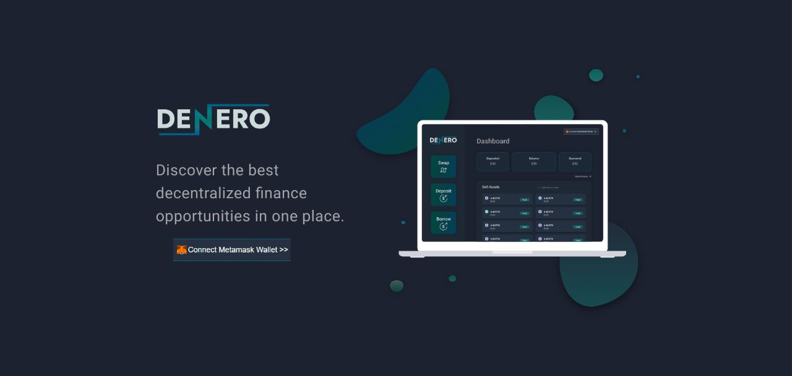

# Denero - Built in FVM SpaceWrap Hackathon

Our team is building a DeFi aggregator on FEVM. Every blockchain needs protocols like market makers and exchanges to function properly. Our product would deploy several clones of protocols and provide a single dashboard for users to interact with any protocol they wish.
  

  
Check it out at [Denero](https://ethglobal.com/showcase/denero-jghku)
 
 
Our project is a DeFi aggregator that allows users to interact with any defi protocol through our dapp. All blockchains require basic financial instruments to provide liquidity if wish to thrive. The need for money markets and exchanges in the FVM ecosystem is crucial for it's growth and our product is ready to tackle that.
  
Since, there are no protocols deployed on the hyperspace testnet yet, we had to build everything from scratch.
  
Our product gives users a smart contract wallet which interacts with protocols we have built for the chain. The user can deposit FIL and reedem Filcoin native stablecoins, they can exchange their tokens with our exchange and even see the balance of each asset they own.
  
Due to limited time, we were forced to leave out many features but we are planning to work hard even after the hackathon and implement ideas like account abstraction, adding NFTs to the protocol, creating governance and making it truly decentralised.

